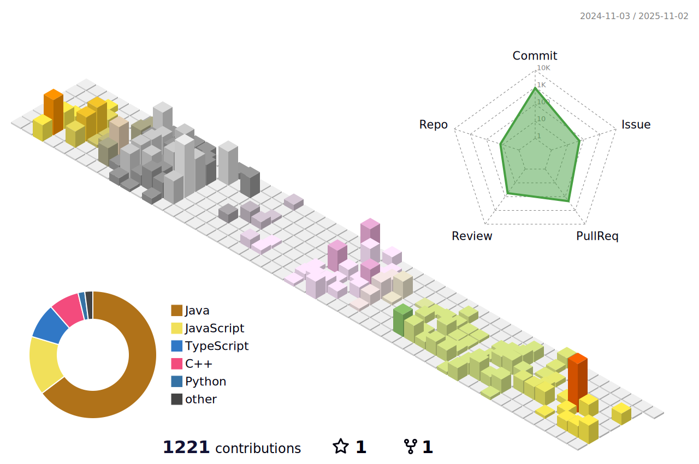

    

    <h2 style="border-bottom: 1px solid #d8dee4; color: #282d33;"> 🛠️ Tech Stacks </h2>   
    
 
          
          
          
          
           
          
          

    

    

    <h2 style="border-bottom: 1px solid #d8dee4; color: #282d33;"> 🧑‍💻 Contact me </h2>   
    
 
         
          
    
    
  
 
    

    
 
    <h2 style="border-bottom: 1px solid #d8dee4; color: #282d33;"> 🅠Stats </h2> 
   
 
    

    

# Blog posts
<!-- BLOG-POST-LIST:START -->
- [CS&rpar; OOAD와 UML 개발 방식](https://tmddnr3503.tistory.com/111)
- [CS&rpar; CASE, 럼바우 기법, 요구사항 모델링](https://tmddnr3503.tistory.com/102)
- [CS&rpar; 객체지향 설계 원칙과 OOAD](https://tmddnr3503.tistory.com/101)
- [CS&rpar; 응집도 &lpar; Cohesion &rpar;](https://tmddnr3503.tistory.com/100)
<!-- BLOG-POST-LIST:END -->
